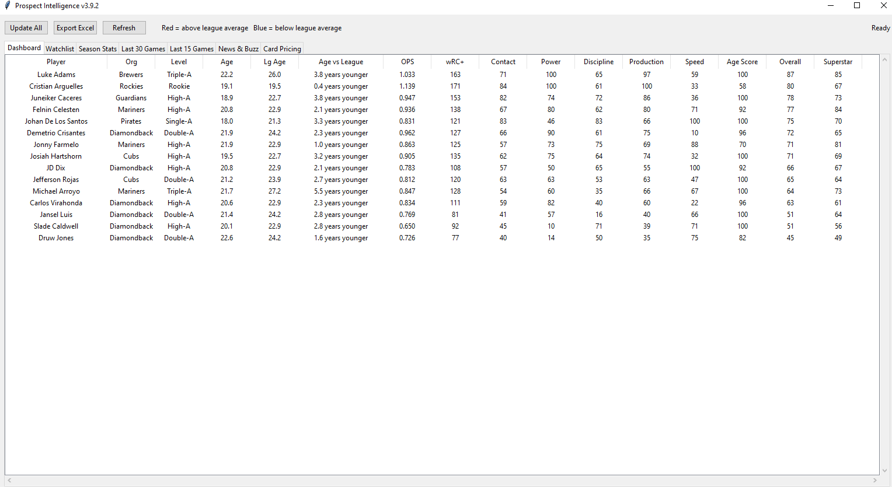
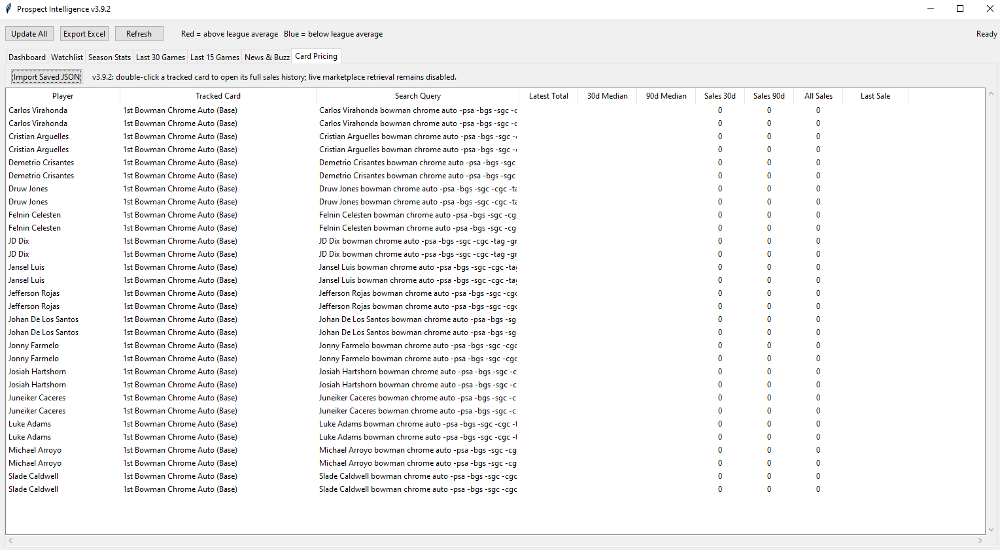
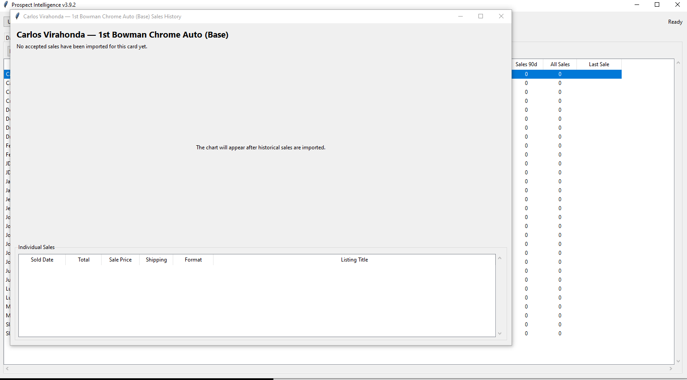

# Prospect Intelligence

**Prospect Intelligence** is a Windows desktop application that combines **baseball prospect analytics** with **sports card market intelligence** to help identify undervalued prospect cards before the market fully recognizes player development.

The application integrates player performance, promotions, news, and historical eBay sales data into a single research platform for prospect evaluation and card pricing analysis.

---

## Features

### Prospect Analytics
- Minor League player performance tracking
- Promotion Probability Score
- Superstar Score
- Buzz Score
- Injury and news monitoring
- Prospect rankings and trend analysis

### Card Market Analytics
- Historical sports card sales analysis
- Median and average sale prices
- Sales volume tracking
- Historical price charts
- Price trend analysis
- Market movement tracking

### eBay Marketplace Integration
Prospect Intelligence uses the **eBay Marketplace Insights API** to retrieve completed sales for selected sports cards.

The application filters out non-comparable listings including:

- Graded cards
- Parallel variations
- Colored refractors
- Lots
- Unrelated listings

Historical sales are stored locally to generate pricing charts, calculate market statistics, and identify pricing trends.

eBay listing information is **not redistributed or republished**.

---

## Technology

- Python
- Tkinter
- SQLite
- MLB Stats API
- eBay Marketplace Insights API
- Matplotlib

---

## Development Status

🚧 **Currently in private development**

Current functionality includes:

- Prospect tracking
- Historical card pricing
- Interactive pricing charts
- News aggregation
- Promotion analytics
- Superstar scoring
- Buzz scoring

Additional market intelligence features are currently under development.

---

## Planned Features

- Advanced card market analytics
- Market Opportunity Score
- Automated pricing alerts
- Historical player development timelines
- Collection management
- Additional card market integrations

---

## Screenshots

### Main Dashboard

The dashboard combines player performance, prospect analytics, promotion probability, and news into a single interface.

---

### Card Pricing

The Card Pricing tab retrieves completed sales, tracks historical pricing, and calculates market statistics for prospect cards.

---

### Historical Price Chart

Interactive historical price charts allow users to visualize market movement over time and compare pricing trends.

## Purpose

The goal of Prospect Intelligence is to combine player development analytics with sports card market data to help collectors and investors make more informed decisions using objective performance metrics and historical pricing information.
